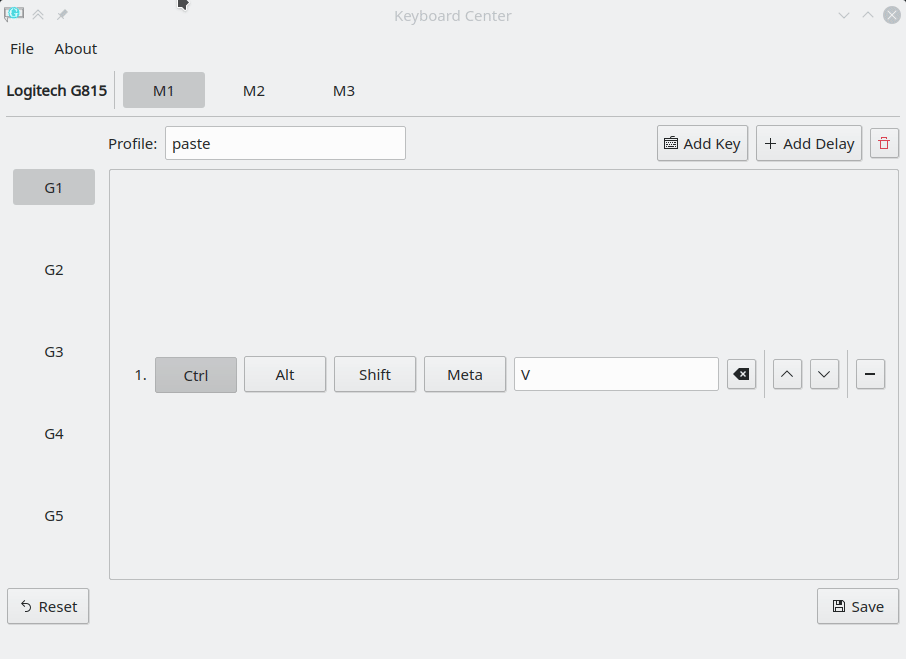
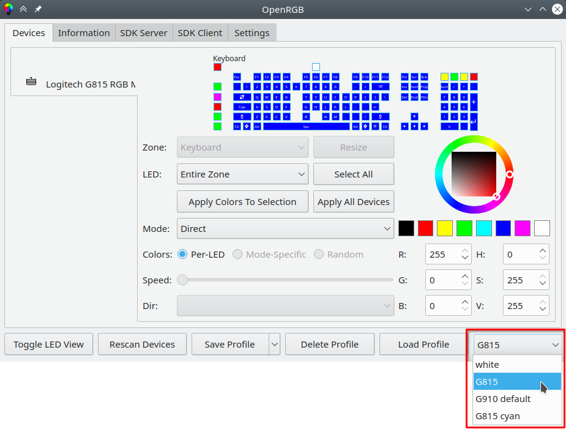
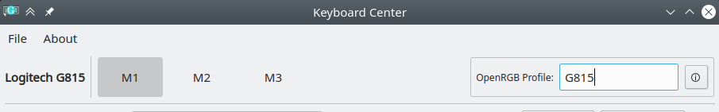

#  Keyboard Center

Keyboard Center is an application attempting to create an easy way for users to map their macro keys of their >100$ keyboard to useful actions, because Logitech does not give a fuck.

**Unlike some other solutions, this application works alongside with RGB software like [OpenRGB](https://openrgb.org/)!**

**NOTE:** This application is written for **Linux only**, on Windows use whatever bloatware the vendor wants you to use.

## Features

- [x] Mapping of keys, combos and macros
- [x] Ability to map keys to buttons and commands
- [x] Ability to map keys to a LUA script for more advanced macros
- [x] Ability to add delays between actions
- [x] Support for switching LEDs of profile keys
- [x] Import and export of the configuration (added ability to open configuration folder instead)
- [x] openRGB integration - linking of macro profiles with openRGB profiles
- [x] libhidraw backend compatible with other control software like openRGB
- [ ] Application specific profiles *(on hold until there is a common way to do this on Wayland[^1])*

[^1]: For more information see [this](https://github.com/flatpak/xdg-desktop-portal/issues/304) and [this](https://unix.stackexchange.com/questions/399753/how-to-get-a-list-of-active-windows-when-using-wayland) and [this](https://askubuntu.com/questions/1414320/how-to-get-current-active-window-in-ubuntu-22-04)

## Supported Keyboards

- Logitech G910 Orion Spectrum (046d:c335)
- Logitech G910 Orion Spark (046d:c32b) (thanks to [@microdou](https://github.com/microdou))
- Logitech G710+ (046d:c24d) (big thanks to [@nirenjan](https://github.com/nirenjan))
- Logitech G815 (046d:c33f) (thanks to [@nickbuss](https://github.com/nickbuss))
- Logitech G510 (046d:c22d) (thanks to [@Flying--Dutchman](https://github.com/Flying--Dutchman))
- Logitech G510 (046d:c22e) (thanks to [@JoZ3](https://github.com/JoZ3))
- Logitech G935 (046d:0a87) _(partial support)_ (thanks to [@coxaka](https://github.com/coxaka))

## Install

### Arch / Manjaro

- v1: [[AUR] keyboard-center](https://aur.archlinux.org/packages/keyboard-center/)
- v2: [[AUR] keyboard-center2](https://aur.archlinux.org/packages/keyboard-center2/)

### Debian / Ubuntu

- Download `.deb` from [release page](https://github.com/zocker-160/keyboard-center/releases)
- Install using package manager of your choice or in terminal: `apt install ./<packagename>.deb`

NOTE: v2 only works with Ubuntu 24.04 LTS and newer due to Python3.12 dependency

## OpenRGB Integration
### Step 1: Create Profile(s) in OpenRGB

### Step 2: Specify Profile in Keyboard Center

**note:** if you install OpenRGB after Keyboard Center, you will need to restart it.

## LUA scripting

The basics of LUA scripting are explained in the [LUA template](src/lua/template.lua). \
For examples see the [examples folder](lua_examples/).

## Manage Background Service

Keyboard Center places itself into the system tray (unless disabled see [CLI options](#cli-options)).

If you try to open a secondary instance, it ~will~ should reactivate the primary one if minimized or hidden.

## Settings

Settings are stored in a `settings.json` file, which is located at
- `$XDG_CONFIG_HOME/keyboard-center` **or** if not defined
- `$HOME/.config/keyboard-center`

## CLI options

- `-v` `--version`: prints version (duh)
- `--background-mode`: hides tray icon
- `--dev`: meant for development purposes only

## Known issues
### Icons on buttons and in the menu not visible

Keyboard Center relies on icons provided by the desktop environment. 
Some DEs (like i3) don't seem to provide those, so in that case you can manually overwrite the used icon theme by setting `XDG_SESSION_DESKTOP` and `XDG_CURRENT_DESKTOP` ENV variables.

Two known good values are `KDE` (recommended) and `GNOME`.

Thanks to [@scott-carrion](https://github.com/scott-carrion) for this info.

## Dependencies
#### Debian / Ubuntu
- python3 >= 3.12
- python3-pyqt5 >= 5.15
- python3-uinput
- python3-usb
- python3-lupa >= 1.14.1
- python3-setuptools
- libhidapi-hidraw0
- libnotify-bin
- lua

#### Arch / Manjaro
- python >= 3.12
- python-pyqt5 >= 5.15
- python-uinput >= 1.0.1
- python-lupa >= 1.14.1
- python-pyusb >= 1.0.2
- hidapi >= 0.10
- libnotify >= 0.7.9
- lua

## Contribute New Keyboard

- make sure all required dependencies are installed + `git`
- `git clone https://github.com/zocker-160/keyboard-center`
- `cd keyboard-center`
- make sure that `usbVendor` and `usbProduct` in `src/newDeviceDebugger.py` is set properly\
(you can check with `lsusb`)
- **you might need to run the following commands with `sudo` if you get permission errors**
- `python3 src/newDeviceDebugger.py` and press all memory keys, macro keys and multimedia keys one after each other
- `python3 src/newDeviceDebugger.py --info`
- exit with `CTRL + C` (can take a second or two)
- open a new issue and provide output of the last two commands and the USB ID of your keyboard

**overall it should look something like this:**

