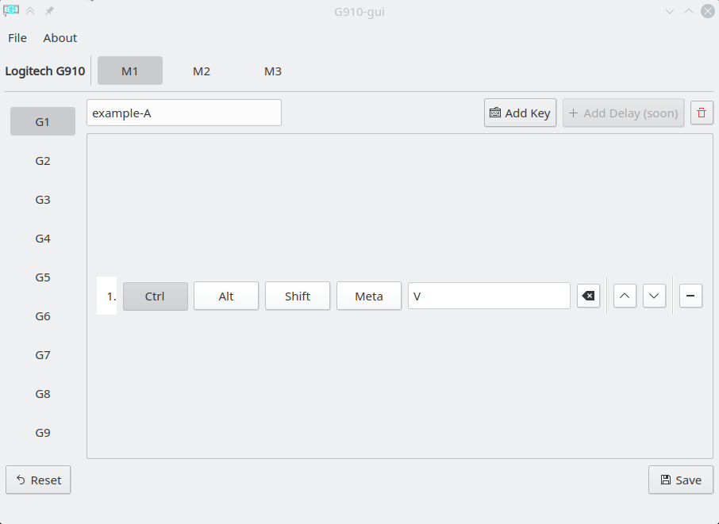
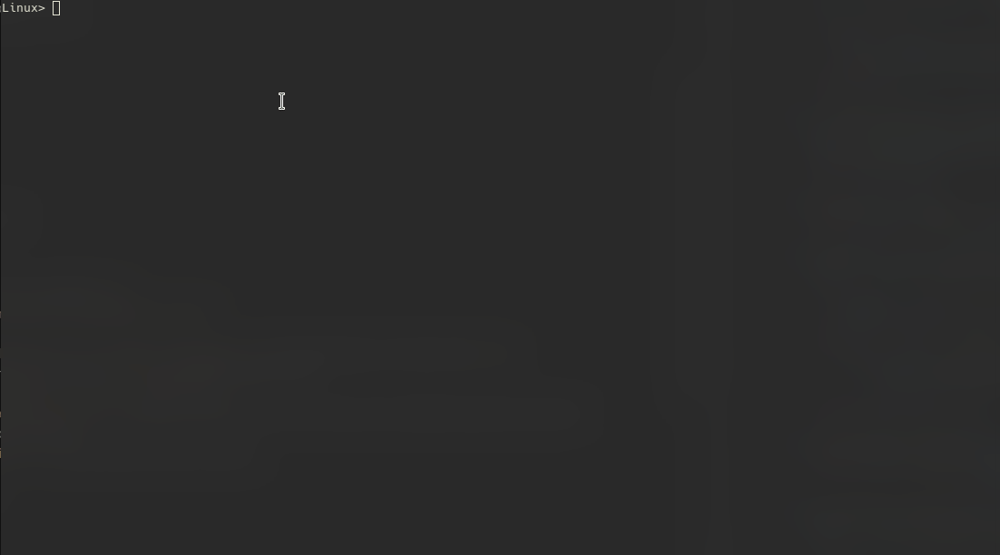

#  Keyboard Center (WiP)

**(work in progress)**

Keyboard Center is an application attempting to create an easy way for users to map their macro keys of their >100$ keyboard to useful actions, because Logitech does not give a fuck.

**Unlike some other solutions, this application works alongside with RGB software like [OpenRGB](https://openrgb.org/)!**

**NOTE:** This application is written for **Linux only**, on Windows use whatever bloatware the vendor wants you to use.

## Supported Keyboards

- Logitech G910 Orion Spectrum (046d:c335)
- Logitech G910 Orion Spark (046d:c32b) (thanks to [@microdou](https://github.com/microdou))
- Logitech G710+ (046d:c24d) (big thanks to [@nirenjan](https://github.com/nirenjan))
- Logitech G815 (046d:c33f) (thanks to [@nickbuss](https://github.com/nickbuss))

## Install

### Arch / Manjaro

available in the AUR: [[AUR] keyboard-center](https://aur.archlinux.org/packages/keyboard-center/)

### Debian / Ubuntu

available in the MPR: 
- [[MPR] keyboard-center](https://mpr.hunterwittenborn.com/packages/keyboard-center/)
- [[MPR] keyboard-center-git](https://mpr.hunterwittenborn.com/packages/keyboard-center-git/)

#### Direct download

- Download `.deb` from [release page](https://github.com/zocker-160/keyboard-center/releases)
- Install using package manager of your choice or in terminal: `gdebi <packagename>.deb`

## Manage Background Service

Keyboard Center does install a background service, which runs with user rights.

You can manage it using:\
`systemctl --user status|start|stop|restart|enable|disable keyboard-center.service`

## Settings

Settings are stored in a `settings.yml` file, which is located at
- `$XDG_CONFIG_HOME/keyboard-center` **or** if not defined
- `$HOME/.config/keyboard-center`

#### Current default settings
`settings: {usbTimeout: 1000, retryCount: 5}`

### Dependencies
#### Debian / Ubuntu
- python3
- python3-pip (<= 0.1.4)
- python3-pyqt5
- python3-usb
- python3-uinput
- python3-ruamel.yaml
- libhidapi-hidraw0 | libhidapi-libusb0 (>= 0.1.9)
- libnotify-bin

#### Arch / Manjaro
- python >= 3.8
- python-pyqt5 >= 5.14
- python-pip >= 20 (<= 0.1.4)
- python-uinput >= 0.11.2
- python-ruamel-yaml >= 0.15
- python-pyusb >= 1.0.2
- hidapi>=0.10 (>= 0.1.9)
- python-inotify-simple >= 1.3 (<= 0.1.4)
- libnotify >= 0.7.9

### Contribute New Keyboard

- make sure all required dependencies are installed + `git`
- `git clone https://github.com/zocker-160/keyboard-center`
- `cd keyboard-center`
- make sure that `usbVendor` and `usbProduct` in `src/newDeviceDebugger.py` is set properly\
(you can check with `lsusb`)
- **you might need to run the following commands with `sudo` if you get permission errors**
- `python3 src/newDeviceDebugger.py` and press all memory keys, macro keys and multimedia keys one after each other
- `python3 src/newDeviceDebugger.py --info`
- exit with `CTRL + C` (can take a second or two)
- open a new issue and provide output of the last two commands and the USB ID of your keyboard

**overall it should look something like this:**

